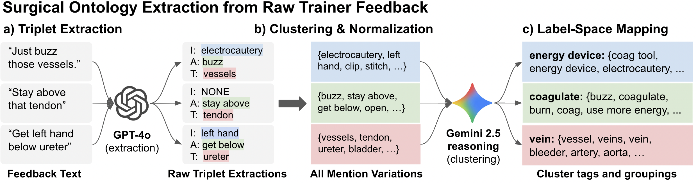
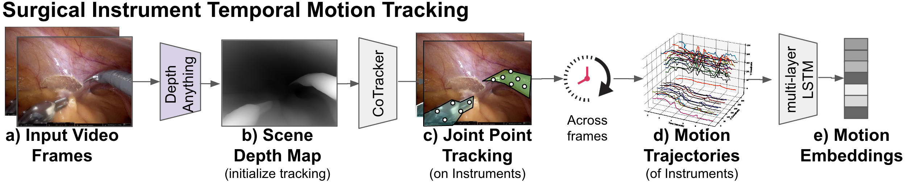

# Generating Natural-Language Surgical Feedback: From Structured Representation to Domain-Grounded Evaluation
---
#### **Authors**: Firdavs Nasriddinov*, Rafal Kocielnik*, Anima Anandkumar, Andrew J. Hung

This official repository holds code for the paper "**Generating Natural-Language Surgical Feedback: From Structured Representation to Domain-Grounded Evaluation**". Our [paper](https://openreview.net/forum?id=cuKblBdJ1M) is accepted at [ML4H 2025](https://ahli.cc/ml4h/). We open source all code here under a permissive MIT license, to encourage reproduction and further research exploration. 


<hr>


<hr>


<hr>


## Overview
This work presents an end-to-end system for generating surgeon-aligned natural-language feedback from operative video, grounded in explicit Instrument-Action-Tissue (IAT) semantics. We address the challenge of automating high-quality surgical feedback—critical for trainee skill development—by combining structured clinical representations with modern vision-language models. Our approach first extracts a surgical action ontology from real trainer-to-trainee transcripts, then uses this structure to condition feedback generation, ensuring outputs remain clinically meaningful and auditable.
The framework consists of three key steps:

The framework consists of three key steps:
1. **Instrument-Action-Tissue Prediction**: We predict IAT triplets from surgical video by fusing visual embeddings, temporal instrument motion tracks (via CoTracker), and clinical context (procedure/task descriptions). This multi-modal approach achieves AUC improvements of 10-12% for instruments and 7-13% for tissues compared to vision-only baselines.

2. **Feedback Generation**: Predicted IAT triplets condition GPT-4o to generate natural trainer-style feedback. A confidence gate ensures only high-quality predictions are used, improving alignment scores by 12.4% and increasing admissible outputs (score ≥3) from 21% to 42%.

3. **Generated Feedback Evaluation**: We assess feedback quality using a clinician-aligned 1-5 fidelity rubric implemented via LLM-as-judge, validated against human expert ratings (κ=0.82). This provides interpretable evaluation beyond traditional text metrics.

## Setup

### Prerequisites

- Python >=3.10
- LLM-provider API key (either is fine):
    - OpenAI API key
    - Google API key

### Installation

1. Clone the repository:
    ```sh
    git clone https://github.com/firdavsn/SurgFBGen.git
    cd SurgFBGen
    ```

2. Ensure uv (Python package manager) is installed on your system:
    https://docs.astral.sh/uv/getting-started/installation/

3. Run setup.sh:
    ```sh
    # Sets up environment and downloads SurgVLP + co-tracker
    source setup.sh
    ```

4. Copy ```.env.example``` into ```.env``` and set environment variables.

### Run
 ```sh
uv run surgfbgen/main.py
```

## Results
**Table 1: Performance of automated Surgical Action Triplet recognition from surgical video.** Reporting AUCs and relative gains for Instrument, Action, and Tissue prediction across different context inputs with SurgVLP, HecVL, and PeskaVLP base models. We observe consistent gains from added clinical context and further improvements from our ***temporal instrument tracking***. Superscripts mark statistically significant AUC gains compared to the previous context condition (paired DeLong test with Holm correction within base model: <sup>**</sup>*p*<sub>adj</sub><0.01, <sup>*</sup>*p*<sub>adj</sub><0.05); statistical analysis details in Appendix.

| **Base Model** | **Context** | **Instrument** | | **Action** | | **Tissue** | |
| :--- | :--- | :--- | :--- | :--- | :--- | :--- | :--- |
| | | AUC | Gain | AUC | Gain | AUC | Gain |
| **GPT-4o** | **Vision+Proc./Task+Tracking** | **0.50<sub>&pm;0.01</sub>** | **-** | **0.51<sub>&pm;0.01</sub>** | **-** | **0.52<sub>&pm;0.02</sub>** | **-** |
| SurgVLP | Vision | 0.65<sub>&pm;0.02</sub> | - | 0.58<sub>&pm;0.02</sub> | - | 0.70<sub>&pm;0.01</sub> | - |
| | + Procedure | 0.67<sub>&pm;0.02</sub> | 3.1% ↑ | 0.58<sub>&pm;0.02</sub> | 0.0% ↓ | 0.73<sub>&pm;0.01</sub> | 4.3% ↑ |
| | + Task | 0.70<sub>&pm;0.01</sub> | 7.7% ↑ | 0.60<sup>*</sup><sub>&pm;0.01</sub> | 3.4% ↑ | 0.76<sub>&pm;0.02</sub> | 8.6% ↑ |
| | + Temporal Tracking (our) | **0.73<sub>&pm;0.03</sub>** | 12.3% ↑ | **0.61<sub>&pm;0.01</sub>** | 5.2% ↑ | **0.79<sup>**</sup><sub>&pm;0.01</sub>** | 12.9% ↑ |
| HecVL | Vision | 0.68<sub>&pm;0.04</sub> | - | 0.60<sub>&pm;0.01</sub> | - | 0.74<sub>&pm;0.02</sub> | - |
| | + Procedure | 0.68<sub>&pm;0.03</sub> | 0.0% ↓ | 0.60<sub>&pm;0.01</sub> | 0.0% ↓ | 0.76<sub>&pm;0.02</sub> | 2.7% ↑ |
| | + Task | 0.71<sub>&pm;0.04</sub> | 4.4% ↑ | 0.61<sub>&pm;0.01</sub> | 1.7% ↑ | 0.77<sub>&pm;0.03</sub> | 4.1% ↑ |
| | + Temporal Tracking (our) | **0.74<sub>&pm;0.03</sub>** | 8.8% ↑ | **0.62<sub>&pm;0.01</sub>** | 3.3% ↑ | **0.77<sub>&pm;0.01</sub>** | 4.1% ↑ |
| PeskaVLP | Vision | 0.67<sub>&pm;0.03</sub> | - | 0.60<sub>&pm;0.02</sub> | - | 0.74<sub>&pm;0.02</sub> | - |
| | + Procedure | 0.68<sub>&pm;0.03</sub> | 1.5% ↑ | 0.59<sub>&pm;0.02</sub> | 1.7% ↓ | 0.75<sub>&pm;0.02</sub> | 1.4% ↑ |
| | + Task | 0.69<sub>&pm;0.03</sub> | 3.0% ↑ | 0.60<sub>&pm;0.01</sub> | 0.0% ↓ | 0.74<sub>&pm;0.02</sub> | 0.0% ↓ |
| | + Temporal Tracking (our) | **0.74<sup>*</sup><sub>&pm;0.03</sub>** | 10.4% ↑ | **0.63<sub>&pm;0.02</sub>** | 5.0% ↑ | **0.79<sup>*</sup><sub>&pm;0.01</sub>** | 6.8% ↑ |

---

**Table 2: Performance of our IAT triplet grounded Surgical Feedback Generation.** Comparison of baselines and our methods. Alignment Score (LLM-as-a-judge) and text generation metrics (WER, ROUGE) are reported. Gains and improvements are relative to the best baseline (GPT-4o, Video+context). Superscripts on Alignment Score indicate statistically significant improvements over the GPT-4o Video+context baseline (stratified Wilcoxon/van Elteren with Holm correction: <sup>**</sup>*p*<sub>adj</sub><.01, <sup>*</sup>*p*<sub>adj</sub><.05); statistical analysis details in Appendix.

| **Model** | **Condition** | **Alignment Score** | | | | **Text Generation Scores** | | | |
| :--- | :--- | :--- | :--- | :--- | :--- | :--- | :--- | :--- | :--- |
| | | Mean ↑ | Gain | &ge; 3 | &ge; 4 | WER ↓ | % imp. | ROUGE ↑ | % imp. |
| VQA Llama | Video+context | 1.93<sub>&pm;.03</sub> | | 10.1% | 1.4% | 11.0<sub>&pm;1.0</sub> | | 0.09<sub>&pm;.02</sub> | |
| SurgVLP<sub>+LM</sub> | Video+context | 1.84<sub>&pm;.03</sub> | | 3.8% | 2.9% | 10.5<sub>&pm;0.7</sub> | | 0.11<sub>&pm;.02</sub> | |
| GPT-4o | Video+context | 2.17<sub>&pm;.02</sub> | | 20.6% | 0.3% | 5.1<sub>&pm;0.3</sub> | | 0.11<sub>&pm;.01</sub> | |
| GPT-4o | +(I,A,T) | 2.23<sup>**</sup><sub>&pm;.02</sub> | 2.8% ↑ | 25.1% | 1.7% | 4.3<sub>&pm;0.2</sub> | 15.4% ↓ | 0.12<sub>&pm;.01</sub> | 9.1% ↑ |
| GPT-4o | Context+(I,A,T) | 2.33<sup>**</sup><sub>&pm;.02</sub> | 7.4% ↑ | 32.7% | 2.4% | 4.2<sub>&pm;0.2</sub> | 18.2% ↓ | 0.13<sub>&pm;.01</sub> | 16.5% ↑ |
| GPT-4o | +confidence gate | 2.44<sup>**</sup><sub>&pm;.03</sub> | 12.4% ↑ | 42.0% | 2.9% | 3.5<sub>&pm;0.4</sub> | 31.3% ↓ | 0.18<sub>&pm;.01</sub> | 63.6% ↑ |

**Table 3: Inter-rater agreement on fidelity ratings for LLM-as-judge.** Based on blind Human ratings of 30 stratified examples of aligned LLM-generated and real-world surgeon provided feedback.

| Comparison | $\kappa_{\text{quad}}$ (95% CI) | $\rho$ (95% CI) | $P_o$ (95% CI) |
| :--- | :--- | :--- | :--- |
| Human--Human | 0.70 [0.17, 0.92] | 0.58 [0.24, 0.86] | 0.77 [0.60, 0.90] |
| LLM vs. Avg. Human | 0.82 [0.56, 0.94] | 0.64 [0.33, 0.87] | 0.80 [0.63, 0.93] |
| Human Rater 1 vs. LLM | 0.80 [0.54, 0.93] | 0.79 [0.62, 0.93] | 0.77 [0.60, 0.90] |
| Human Rater 2 vs. LLM | 0.91 [0.70, 1.00] | 0.88 [0.68, 1.00] | 0.90 [0.80, 1.00] |

## Key Components

### Models

- **surgfbgen/models/iat_predictor/IATPredictor**: An individual model for IAT (Instrument, Action, or Tissue) prediction that consists of:
    1. A feature encoder (e.g., LSTMFusionModel) that processes embeddings and tracks
    2. An MLP classifier that operates on the extracted features

- **surgfbgen/models/iat_predictor/LSTMFusionModel**: Temporal encoder that processes instrument motion trajectories to capture kinematic patterns critical for surgical action recognition.

- **surgfbgen/models/feedback_generator/FeedbackGenerator**: LLM-based generator that produces natural-language feedback conditioned on IAT triplets, procedure context, and optional reference examples.

- **surgfbgen/models/feedback_evaluator/FeedbackEvaluator**: Automated evaluation system using LLM-as-judge with a clinician-aligned fidelity rubric to assess feedback quality against ground truth.


### Code

- **surgfbgen/interface.py**: Core library interface providing high-level functions for the complete pipeline—from multi-modal feature extraction through IAT prediction to feedback generation and evaluation. This module integrates all components and provides a clean API for researchers to build upon our framework.

- **surgfbgen/main.py**: Example pipeline implementation demonstrating the complete workflow from raw surgical videos to evaluated feedback. Includes configurable examples for each stage that can be run independently or as an end-to-end system, with all paths controlled via environment variables for easy customization.
Retry

### Interface Functions
- **extract_vis_embs**: Extract visual embeddings from surgical video clips using specified vision model.

- **extract_text_embs**: Extract text embeddings from procedure or task descriptions.

- **extract_motion_embeddings**: Extract motion embeddings from surgical video clips using CoTracker.

- **run_iat_predictor_train_and_eval**: Train and evaluate an IAT predictor using cross-validation.

- **train_via_hybrid**: Trains a hybrid (normal vision and text embeddings + motion embeddings) IATPredictor model for IAT prediction.

- **run_predictions**: Run predictions for one IAT component on a provided dataframe and calculate AUROC and F1 score.

- **run_all_predictions_and_save**: Runs predictions for each IAT predictor (instrument, action, tissue), combines them into a single DataFrame, and saves to a CSV.

- **generate_feedback**: Generates feedback for IAT predictions using a FeedbackGenerator.

- **evaluate_feedback**: Evaluates generated feedback against ground truth using a FeedbackEvaluator.


## Citation
```bash
@inproceedings{
    nasriddinov2025generatingsurgicalfeedback,
    title={Generating Natural-Language Surgical Feedback: From Structured Representation to Domain-Grounded Evaluation}, 
    author={Firdavs Nasriddinov and Rafal Kocielnik and Anima Anandkumar and Andrew Hung},
    year={2025},
    booktitle={Machine Learning for Health 2025},
    url={https://openreview.net/forum?id=cuKblBdJ1M}, 
}
```
---
